# FieldWorks Green Grid station network

Station-by-station design record for the FieldWorks Green Grid deployment at the UC Davis Student Farm. It covers each station, its sensors, its connection path, its data path, and its open tests and decisions.

> Current design basis: TGIF project `S26-214`, six Phase I ENTS field stations, one Phase II Davis Vantage Pro2 Plus meteorological subsystem, and one LoRaWAN gateway. Site locations await Student Farm approval.

## Pick a station

Start with the [visual station atlas](docs/02-stations/station-atlas.md). Each entry covers one physical package, its expected data, and its deployment blockers.

| Station | Physical package | Expected data | Readiness |
|---|---|---|---|
| [IH-01](docs/02-stations/IH-01.md) | D10 meter, pressure sensor, controlled-valve path, ENTS box | total gallons, GPM, psi/MPa, valve command, health | reference build; inventory check and bench test needed |
| [IH-02](docs/02-stations/IH-02.md) | second irrigation package | same fields as IH-01 with identity `IH-02` | procurement submitted; receiving and bench verification pending |
| [SM-01](docs/02-stations/SM-01.md) | three tension depths, soil temperature, VA3, ENTS box | shallow/middle/deep kPa, soil °C, health | reference build; inventory check and ADC map needed |
| [SM-02](docs/02-stations/SM-02.md) | second soil-profile package | same fields as SM-01 with identity `SM-02` | procurement submitted; receiving pending |
| [SM-03](docs/02-stations/SM-03.md) | third soil-profile package | same fields as SM-01 with identity `SM-03` | procurement submitted; receiving pending |
| [SM-04](docs/02-stations/SM-04.md) | fourth soil-profile package | same fields as SM-01 with identity `SM-04` | procurement submitted; receiving pending |
| [MET-01](docs/02-stations/MET-01.md) | wireless Davis Vantage Pro2 Plus 6162 with temp/RH, wind, rain, solar and UV; WeatherLink Live 6100 network bridge | air °C, RH%, wind, rainfall, solar W/m², UV index | 6162 hardware identified; WeatherLink Live/network/bench verification pending |
| [WX-CANDIDATE](docs/02-stations/WX-CANDIDATE.md) | no approved or deployed hardware | no approved stream | concept only |

The six Phase I ENTS stations exclude the Student Farm's four existing Sensus iPERL meters and HOBO MX1104 logger. The SCADAmetrics Signalizer remains on hold pending a compatibility check.

## Architecture

The six Phase I field nodes use ENTS boards with Wio-E5 LoRa radios. They send US915 LoRaWAN packets through the Student Farm gateway to ChirpStack and MQTT. MET-01 is a separate Davis acquisition path: the 6162 sends Davis wireless RF to WeatherLink Live 6100, and a Green Grid adapter sends normalized observations to the common backend. The two paths converge at MQTT/InfluxDB/Grafana rather than at the field radio layer.

## Read in this order

1. [Program overview](docs/00-program/overview.md)
2. [Network architecture](docs/01-architecture/network-overview.md)
3. [Station index](docs/02-stations/README.md)
4. [Station atlas](docs/02-stations/station-atlas.md)
5. [Data contracts and examples](docs/02-stations/data-contracts.md)
6. [Machine-readable data dictionary](docs/02-stations/data-dictionary.csv)
7. [Component specifications](docs/03-hardware/specifications.md)
8. [Manufacturer spec sheet index](docs/03-hardware/spec-sheet-index.md)
9. [Machine-readable specifications](docs/03-hardware/component-specifications.csv)
10. [Connection matrix](docs/03-hardware/connection-matrix.csv)
11. [Station bill of materials](docs/03-hardware/station-bom.csv)
12. [Equipment status](docs/04-procurement/orders.md)
13. [Machine-readable equipment status](docs/04-procurement/orders.csv)
14. [What we need](docs/04-procurement/needs.md)
15. [Machine-readable needs register](docs/04-procurement/needs.csv)
16. [Future hardware plan](docs/04-procurement/purchase-list.md)
17. [Machine-readable future hardware plan](docs/04-procurement/purchase-list.csv)
18. [Equipment readiness](docs/04-procurement/status.md)
19. [Assembly and test plan](docs/05-installation/assembly-and-test.md)
20. [Open decisions](docs/07-decisions/open-decisions.md)
21. [Source index](docs/08-sources/source-index.md)

## Evidence rules

- Check models marked `unverified` against the physical label and datasheet before wiring or replacement procurement.
- Keep raw email, receipts, account data, credentials, and private attachments in protected storage.
- Keep site names and field coordinates blank until the Student Farm approves them.
- Distinguish ENTS/LoRaWAN telemetry from Davis/WeatherLink telemetry while using one normalized backend schema.

## Repository scope

This repository is the technical and operating record for the station network. Private financial evidence, raw Gmail messages, the signed TGIF agreement, and protected FieldWorks source files remain outside it.
