# IH-02 — Irrigation Head Station 2

Status: blocked
Owner: unassigned
Updated: 2026-07-27
Evidence: proposal architecture; compatibility grid; OPP requests `MOGA-BWK26W1`, `MOGA-BAFXD51`, and `MOGA-ETKRUV1`

## Purpose

Replicate the tested irrigation-head design at a second approved irrigation point after IH-01 passes bench acceptance.

## At a glance

| Physical package | Data product | Field question |
|---|---|---|
| second D10 + SEN0257 + valve path + ENTS box | gallons, GPM, psi/MPa, valve command, health | How does the second head's delivery and pressure compare with IH-01? |

## Data expected from IH-02

IH-02 uses the same fields as IH-01: `volume_total_gal`, `flow_rate_gpm`, `pressure_psi`, `pressure_mpa`, `pressure_raw_v`, `valve_command`, `valve_pulse_ms`, and station-health fields. Every record must carry stable identity `IH-02`; location is metadata, not identity.

[See the complete data contract and example payload](data-contracts.md#irrigation-head-record).

## Included instruments

| Item | Model | Quantity | Current state |
|---|---|---:|---|
| Node | ENTS / Wio-E5 | 1 | board received; identity assignment pending |
| Flow meter | D10 with D10-C-SRS | 1 | submitted to OPP; no vendor order evidence |
| Pressure sensor | DFRobot SEN0257 | 1 | submitted to OPP; no vendor order evidence |
| Valve assembly | DIG 305DC-075 complete DC assembly | 1 | submitted to OPP; no vendor order evidence |
| Power and enclosure | shared remaining-station requests | 1 set | submitted; exact allocation not frozen |

## Connections

| Source | Electrical path | ENTS input/output | Firmware/data |
|---|---|---|---|
| D10-C-SRS | dry contact to GPIO and ground with pull-up | GPIO interrupt | one pulse/gallon |
| SEN0257 | 5 V supply; signal through 22 kΩ/47 kΩ divider | ADC | pressure conversion with divider correction |
| DC latching valve | battery through 9 V boost and reversing pulse driver | GPIO command | momentary open/close command |
| solar and LiPo | barrel charger and JST-PH battery path | power subsystem | battery state |
| radio | Wio-E5 | US915 LoRaWAN | station ID `IH-02` |

## Build rule

Do not substitute or assemble IH-02 from request descriptions alone. Wait for vendor order evidence and copy the bench-verified IH-01 connection design only after the exact received components match.

## Installation gates

Same as IH-01, plus a comparison test showing matching flow/pressure behavior across both station builds.
