# MET-01 — Phase II Meteorological Sandbox

Status: blocked
Owner: Johan Marcial Gonzalez / unconfirmed technical owner
Updated: 2026-07-27
Evidence: April 19 ENTS compatibility matrix; later Paw U inventory correspondence; Johan design documents

## Purpose

Use the seventh ENTS board to bench-test loaned meteorological instruments before any mast or field deployment.

## At a glance

| Physical package | Conditional data product | Question |
|---|---|---|
| seventh ENTS board plus one verified loaned instrument at a time | air °C, RH%, wind m/s and direction, cup wind m/s, soil °C | Can the actual loaned instruments be powered, decoded, calibrated, and transmitted through ENTS? |

## Data expected after model verification

| Field | Unit | Baseline source | Current confidence |
|---|---|---|---|
| `air_temp_c` | °C | EE181-L baseline | low until label verification |
| `relative_humidity_pct` | % | EE181-L baseline | low until label verification |
| `wind_speed_ms` | m/s | 05103 baseline | low; model conflict |
| `wind_direction_deg` | degree | 05103 baseline | low; model conflict |
| `cup_wind_speed_ms` | m/s | 014A-L baseline | low; model conflict |
| `soil_temp_c` | °C | TD0030 PT100 baseline | low; sensor-type conflict |

Until then, MET-01 should publish null engineering values with `model_unverified`, never plausible-looking weather numbers.

[See the complete data contract and example payload](data-contracts.md#met-01-record).

## Model-identity gate

The April 19 integration baseline names four instruments, but later inventory evidence conflicts with those names. Do not wire from this baseline until each physical label, cable, and loan record is photographed and checked against its datasheet.

| Role | April 19 baseline | Later evidence | State |
|---|---|---|---|
| temperature and RH | Campbell EE181-L | EE-181 mentioned | likely match; verify suffix and wiring |
| wind speed/direction | Campbell 05103 | two Met One wind sensors mentioned | conflict |
| cup anemometer | Campbell 014A-L | Met One cup sensor mentioned | conflict |
| soil temperature | T-PRO TD0030 PT100 | soil thermistors mentioned; PRT questioned for soil use | conflict |

## Baseline connection design

| Instrument | Signal and power | ENTS path | Extra hardware |
|---|---|---|---|
| EE181-L | two 0–1 V analog outputs; 7–30 V supply | two ADC channels | filtered 5/3.7 V-to-12 V boost |
| 05103 | speed pulse plus direction potentiometer voltage; 5 V excitation | one GPIO counter plus one ADC | terminal path and shield handling |
| 014A-L | passive pulse/frequency | one GPIO counter | signal conditioning if physical unit requires it |
| TD0030 PT100 | three-wire resistance | SPI bus plus chip-select | MAX31865 RTD converter |
| radio | Wio-E5 | US915 LoRaWAN | gateway |

## Resource check

The baseline needs three ADC inputs, two pulse/GPIO inputs, shared SPI plus chip-select, 5 V excitation, boosted 12 V, and common ground. The ENTS screw terminals are tight for this count; use a documented terminal expansion path.

## Acceptance sequence

1. Complete the physical inventory and loan record.
2. Replace every baseline model with the observed model and datasheet.
3. Recalculate voltage, signal conditioning, connector, and pin allocation.
4. Test one instrument at a time.
5. Compare against a reference instrument and record calibration/offset.
6. Only then combine instruments on the node.

## Field gate

No mast, radiation shield, siting, fetch, canopy-height, cable-protection, or return-date plan is approved.
