# SM-03 — Soil Monitoring Station 3

Status: blocked
Owner: unassigned
Evidence: reference-station architecture

## Purpose

Third soil-profile node using the validated SM-01 hardware and firmware design.

## Station interface

**Inside:** 3 × 200SS tension probes, 1 × 200TS temperature probe, 1 × VA3 adapter, and 1 × ENTS box with solar/battery power.

**Data expected:** `tension_shallow_kpa`, `tension_middle_kpa`, `tension_deep_kpa`, `soil_temp_c`, four raw voltages, and station-health fields, all identified as `SM-03`.

**Question answered:** How does the third site's drying rate and depth distribution compare with the other soil stations?

[See the complete data contract and example payload](data-contracts.md#soil-profile-record).

## Instruments and state

| Item | Model | Quantity | Current state |
|---|---|---:|---|
| ENTS node | ENTS / Wio-E5 | 1 | board received; identity assignment pending |
| Soil tension | Watermark 200SS-15 | 3 | planned after the SM-01 reference build passes |
| Soil temperature | Watermark 200TS | 1 | planned after the SM-01 reference build passes |
| Adapter | Watermark 200SS-VA3 | 1 | planned after the SM-01 reference build passes |
| Power/enclosure | remaining-station requests | 1 set | submitted; allocation not frozen |

## Connection map

Three 200SS sensors and one 200TS feed the VA3. Four separate 0–3 V VA3 outputs feed four ENTS ADC channels. Firmware maps each channel to a fixed depth, applies the Irrometer conversion, and sends tension, temperature, battery, and station ID `SM-03` over US915 LoRaWAN.

## Gates

This station is planned for later. Site placement must test spatial variability rather than assume SM-02 data represents the full field.
