# Station atlas

Status: working

Evidence: station BOMs, connection matrix, specifications, and proposed data contracts

Use this page as the network index. Each station has one stable ID, one physical package, and one expected data product.

## Phase I station cards

### IH-01: first irrigation head

**Package:** one weatherproof box and instrument set at one irrigation head.

**Inside and attached:**

- 1 x ENTS node with Wio-E5 US915 radio
- 1 x D10 meter with D10-C-SRS pulse switch
- 1 x SEN0257 pressure sensor
- 1 x valve and DC-latching solenoid path
- voltage divider, boost converter, bidirectional driver, battery, solar, enclosure, and cable fittings

**Data expected:**

- total irrigation volume in gallons
- flow rate in gallons per minute
- line pressure in psi and MPa
- commanded valve state: `open`, `closed`, or `unknown`
- raw pulse and pressure values for diagnosis
- timestamp, station ID, firmware version, radio quality, and power telemetry when supported

**Question:** How much water passed this head, at what pressure, and what did the controller ask the valve to do?

**Current state:** reference irrigation build; inventory confirmation and bench verification are pending.

[Open the complete IH-01 record](IH-01.md)

---

### IH-02: second irrigation head

**Package:** an IH-01 replica at a second approved irrigation head.

**Inside and attached:** the same functional package as IH-01, with the second D10, second SEN0257, and complete valve assembly.

**Data expected:** the IH-01 volume, flow, pressure, valve-command, diagnostic, power, and radio fields with station ID `IH-02`.

**Question:** How does a second irrigation head perform compared with IH-01?

**Current state:** procurement requests submitted; bench build awaits receiving and IH-01 reference verification.

[Open the complete IH-02 record](IH-02.md)

---

### SM-01: first soil profile

**Package:** one weatherproof box connected to four probes at one approved field location.

**Inside and attached:**

- 1 x ENTS node with Wio-E5 US915 radio
- 3 x Watermark 200SS tension sensors labeled shallow, middle, and deep
- 1 x Watermark 200TS soil-temperature sensor
- 1 x 200SS-VA3 four-channel adapter
- battery, solar, enclosure, glands, and labeled probe cables

**Data expected:**

- soil water tension in kPa at shallow, middle, and deep depths
- soil temperature in °C
- four raw adapter voltages for diagnosis
- timestamp, station ID, firmware version, radio quality, and power telemetry when supported

**Question:** Where is the soil profile drying, how quickly, and at what soil temperature?

**Current state:** reference soil build; inventory confirmation and a frozen four-channel ADC map are pending.

[Open the complete SM-01 record](SM-01.md)

---

### SM-02: second soil profile

**Package:** the SM-01 package at a second approved field location.

**Data expected:** shallow, middle, and deep tension plus soil temperature, identified as `SM-02`.

**Question:** How does the second location's root-zone water profile compare with SM-01?

**Current state:** procurement request submitted; build awaits receiving and SM-01 reference verification.

[Open the complete SM-02 record](SM-02.md)

---

### SM-03: third soil profile

**Package:** the SM-01 package at a third approved field location.

**Data expected:** shallow, middle, and deep tension plus soil temperature, identified as `SM-03`.

**Question:** How does the third location differ in drying rate and depth distribution?

**Current state:** procurement request submitted; build awaits receiving and SM-01 reference verification.

[Open the complete SM-03 record](SM-03.md)

---

### SM-04: fourth soil profile

**Package:** the SM-01 package at a fourth approved field location.

**Data expected:** shallow, middle, and deep tension plus soil temperature, identified as `SM-04`.

**Question:** How does the fourth location differ, and does the four-station pattern show meaningful spatial variation?

**Current state:** procurement request submitted; build awaits receiving and SM-01 reference verification.

[Open the complete SM-04 record](SM-04.md)

## Phase II card

### MET-01: meteorological integration sandbox

**Package:** existing wireless Davis Vantage Pro2 Plus 6162 sensor suite plus one WeatherLink Live 6100 receiver/network bridge.

**Installed sensors and ports:**

- temperature/RH assembly -> `TEMP HUM`
- Vantage Pro2 anemometer/wind vane -> `WIND`
- Davis rain collector -> `RAIN`
- Davis 6450 Solar Radiation Sensor -> `SUN`
- Davis 6490 UV Sensor -> `UV`

**Data expected:**

- air temperature in °C
- relative humidity in percent
- wind speed in m/s
- wind direction in degrees
- rainfall and rain rate
- solar radiation in W/m²
- UV index
- source/ingestion timestamps and quality flags

**Question:** Can the existing wireless Davis station provide stable, traceable meteorological observations through WeatherLink and into the common Green Grid backend?

**Compatibility:** the five weather sensors connect directly to the Davis 6162 Sensor Interface Module. MET-01 does not require ENTS ADC/GPIO channels and does not use the Green Grid LoRaWAN gateway. WeatherLink Live receives Davis wireless RF and exposes the observations to the software/backend layer.

**Current state:** Davis 6162 and populated sensor ports verified; WeatherLink Live 6100, network/API test, reference comparison, and field siting remain open.

[Open the complete MET-01 record](MET-01.md)

## Design candidate

### WX-CANDIDATE: Johan weather concept

WX-CANDIDATE holds proposed instruments outside the station network. Exact models, scientific questions, interfaces, and overlap remain open.

[Open the candidate record](WX-CANDIDATE.md)

## Reading the data

- [Data contracts and example records](data-contracts.md)
- [Machine-readable data dictionary](data-dictionary.csv)
- [Network and storage path](../01-architecture/network-overview.md)
- [Connection matrix](../03-hardware/connection-matrix.csv)
