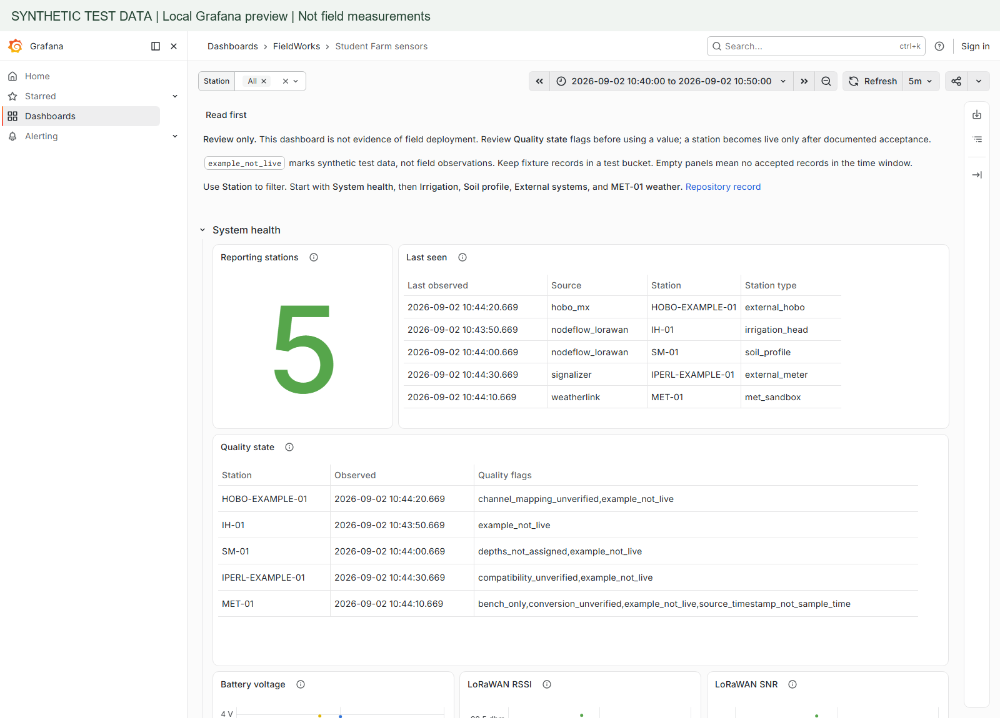
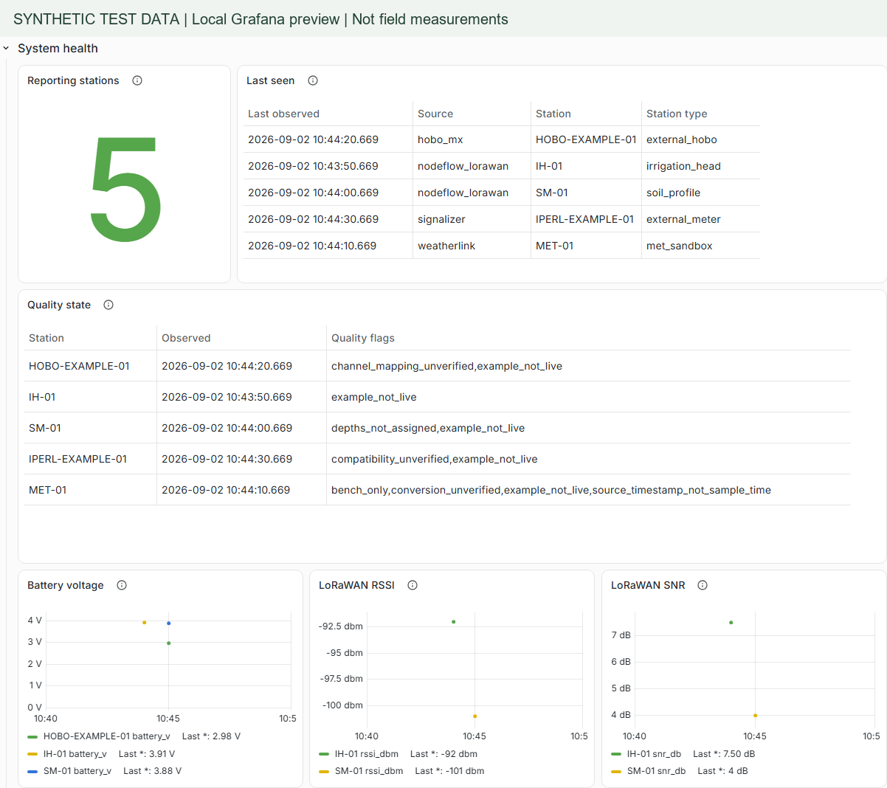
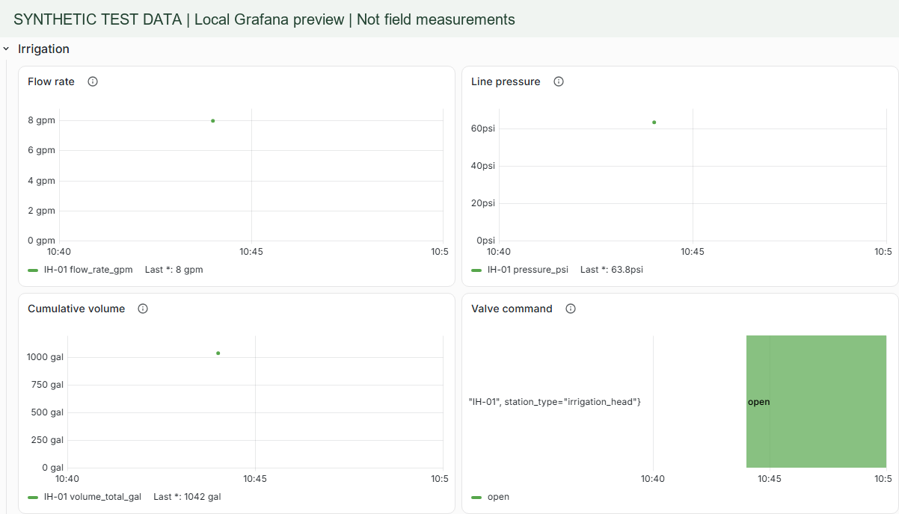
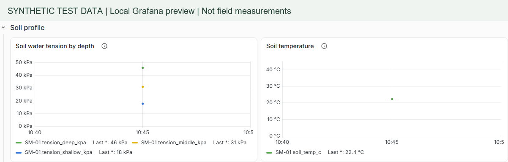
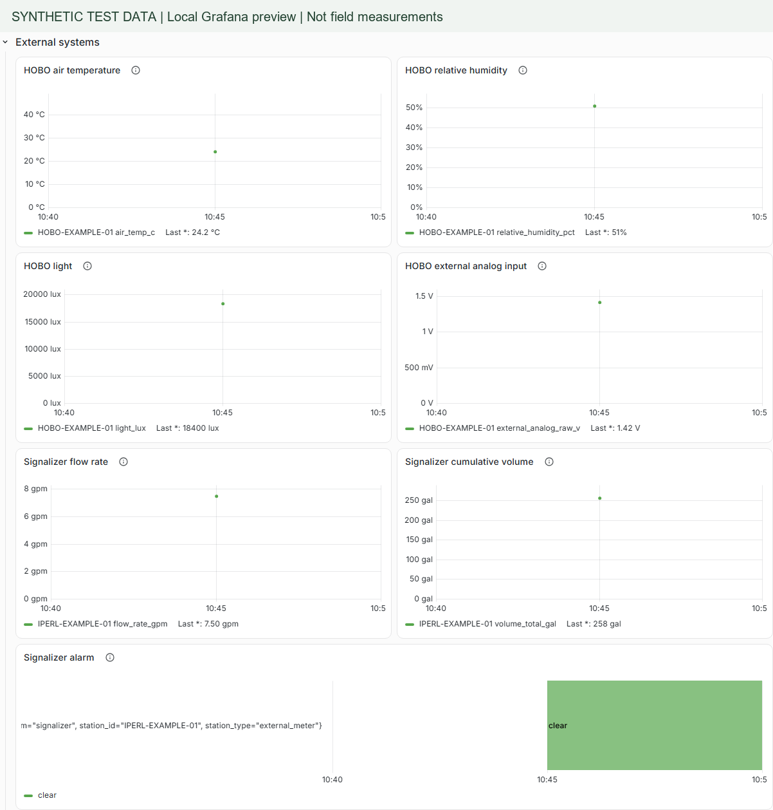
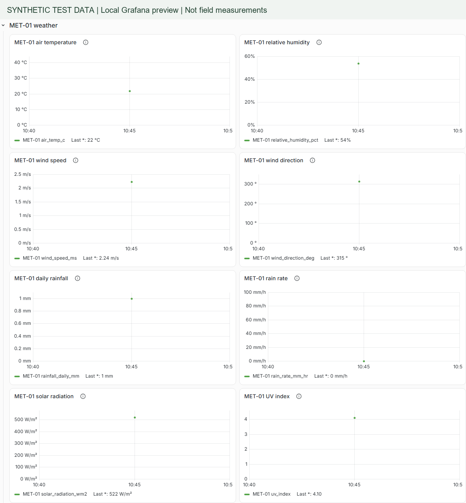

# Dashboard screenshots

These screenshots show the working local Grafana dashboard with five existing synthetic test records from September 2, 2026. They are not field measurements or evidence of installed stations. Single points show fixture values, not measured trends. Green Grid is funded by The Green Initiative Fund at UC Davis.

Use the Station filter to inspect one source. Check the quality flags and observation time before interpreting a value. An empty panel means no accepted records in the selected window, not necessarily a failed sensor.

## Overview

The start view explains the data state and shows station count and observation times.

## System health

Station identity, latest observations, quality flags, battery voltage, and radio signal. A station count is not a count of deployed stations.

## Irrigation

Flow, pressure, cumulative volume, and valve-command state. A command is not proof of valve movement.

## Soil

Soil water tension channels and temperature. Physical depths still need assignment and verification.

## External systems

HOBO temperature, humidity, light, and analog input; Signalizer flow, volume, and alarm state. Channel mapping, compatibility, and live access still need verification.

## Weather

Davis temperature, humidity, wind, rain, solar radiation, and UV. These are synthetic examples, not a live weather feed.

## Verification

Captured September 11, 2026 from the local Grafana UI. All 27 data panels across five sections rendered without browser or query errors. The station filter and a 390-pixel viewport were checked. All 37 unit tests and the repository validator passed. The display changes preserve every telemetry query and the dashboard UID. No new fixture records were generated for these images.

## Improve or run the dashboard

- [Dashboard source](../../scripts/build_dashboard.py): edit the generator, then regenerate the JSON.
- [Runtime and test instructions](grafana.md): local setup and acceptance checks.
- [Telemetry schema](telemetry-schema.md): fields, units, and quality flags.
- [Station atlas](../02-stations/station-atlas.md): hardware and data paths.

Before treating a source as live, verify one physical station through the full data path. Keep test records separate from production data.
